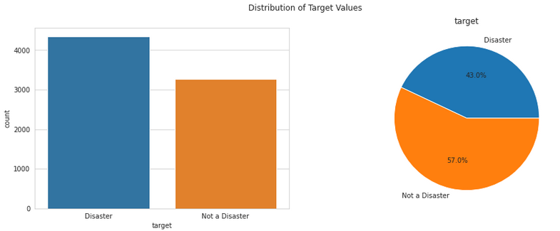
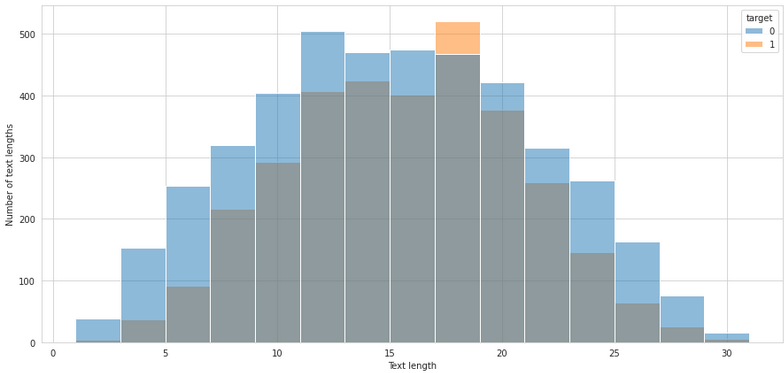
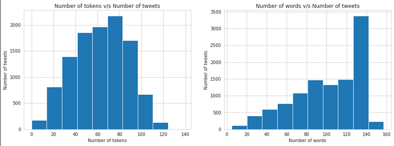
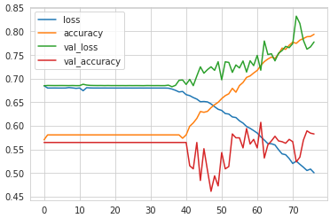
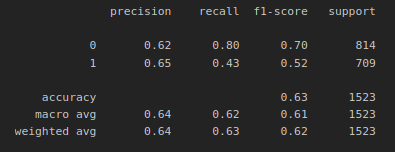

### AccidentTweets

This project is my first project utilizing deep-learning for natural language processing and is a classical "Ham or spam" problem. The dataset which is used is a collection of tweets related to accidents combined with irrelevant tweets. 

## Data
Firstly some visualization is done in order to determine if it heavely favours any specific result.

It does not look like that's the case so we continue with some more visualizations. Is there any correlation between the target outcome and length of the tweets?

We can see somewhat of a correlation of the tweets being longer if the tweet is not a disaster.
Let't Tokenize and preprocess the data!

After the tokenization we can see that the number of words in the tweets has decreased. In non-tokenized it clearly shows that the longer tweets contains a lot of stopwords. 

## Model
Let's create a model, there are many ways of creating a NLP model however I chose to create a model based on LSTM layers. A dropout of 20% was used and early stoppage with a high patience. It was noted that the model needed some epochs to start take into consideration the positive targets. This might have to do with the pretrained GloVe embeddings that was used or my implementation of it. 

The model history looks something like this:

As seen, it takes a while for the model to start realizing there are other options than just to assume every target is a zero, with a large scale dataset this model would be poorly optimized, ideally the model should start learning instantly.

The early stoppage was based on validation loss wich prevents overfitting in comparison with an early stoppage based on accuracy. Therefore in my case even though the model continues for quite a few more epochs than would be considered optimal, the early stoppage prevent us from using an overfittet model. 

A classification report is created in order to get a rough insight how the model performed:

